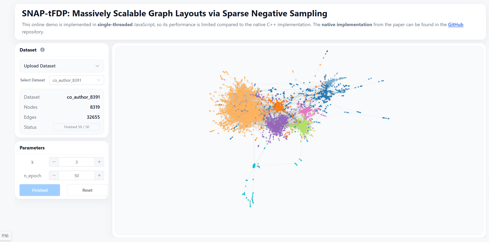

# SNAP-tFDP: Massively Scalable Graph Layouts via Sparse Negative Sampling

SNAP-tFDP (Stochastic Negative-sampling Accelerated Placement t-FDP) achieves \(O(|E|)\) time complexity with a low memory footprint, without requiring complex multi-level representations.

Here is the online demo of SNAP-tFDP: [SNAP-tFDP-online](https://anonymoususer202604.github.io/snap-tfdp-online/), deployed on GitHub Pages. The repository for this page is available here: [Repo Link](https://github.com/AnonymousUser202604/snap-tfdp-online).

[](https://anonymoususer202604.github.io/snap-tfdp-online/)

## Directory Structure

- `apps/`: Sources of executables
- `data/`: Dataset directory (large datasets were uploaded to [Osfstorage](https://osf.io/dtxa5/files/osfstorage))
    - `PMDS_init`: Init position files
    - `*.txt`: Edge data files
    - `*.attr`: Node label files
- `include/`: Header files
- `lib/`: Third-party libraries
- `src/`: Source code
    - `graph/`: Graph definitions
    - `layout/`: Layout algorithms
    - `metrics/`: Our custom multi-threaded NP metric implementation
- `figures/`: Figures used in the paper
- `scripts/`: Experiment scripts
- `results/`: Experiment outputs (2D embedding coordinates and images)
- `statistics/`: Metric statistics for experiment results
- `tools/`: Utility tools
- `third_party/`: Code repositories of baseline/comparison methods

---

## Data Formats

### Graph edge files

- `txt`
    - Used by this project and some baselines
    - First line: `N M`
    - Next `M` lines: `src dst weight`
    - Weight is always `1`
- `mtx`
    - Each line: `src dst`
- `dot`
    - Used only by GraphViz

### Label files

- `attr`
    - `N` lines
    - Each line is one integer label
    - `-1` means unlabeled

---

## SNAP-tFDP

### Requirements

For a normal Linux build environment on Ubuntu/Debian:

```bash
sudo apt update
sudo apt install -y build-essential cmake g++
```

If you want CPU parallel mode (`-DENABLE_PARALLEL=ON`), your compiler should support OpenMP.

If you want GPU mode (`-DENABLE_CUDA=ON`), you also need:

- an NVIDIA GPU
- a working NVIDIA driver
- CUDA Toolkit with `nvcc`

Typical check commands:

```bash
nvidia-smi
nvcc --version
```

### Build

```bash
cmake -S . -B build
cmake --build build --target snap-tfdp
# executable location: ./snap-tfdp
```

This builds the default single-threaded executable `snap-tfdp`.

#### Options

`CMakeLists.txt` currently supports these options:

- `-DENABLE_PARALLEL=ON`: enable OpenMP-based CPU parallel code
- `-DENABLE_CUDA=ON`: enable CUDA code
- `-DMETRICS=ON`: build metric tools
- `-DOGDF=ON`: build OGDF-based tools, including `fr` and `pmds`

Example build with both CPU-parallel and GPU-related code enabled:

```bash
cmake -S . -B build -DENABLE_PARALLEL=ON -DENABLE_CUDA=ON
cmake --build build --target snap-tfdp
# executable location: ./snap-tfdp
```

> If you enable CUDA, make sure `CMAKE_CUDA_COMPILER` points to your `nvcc`.

---

### Usage

```shell
SNAP-tFDP

./snap-tfdp [OPTIONS] dataset output

POSITIONALS:
  dataset TEXT REQUIRED       Dataset path
  output TEXT REQUIRED        Output path

OPTIONS:
  -h,     --help              Print this help message and exit
          --init TEXT:{pmds,random,spiral}
                              Init method: pmds, random, spiral
          --pmds-file TEXT    PMDS initialization file path (required when --init pmds)
  -t,     --n-epoch INT:NONNEGATIVE
                              Number of epochs
  -k,     --k INT:POSITIVE    Negative sampling number (param k)
          --seed INT          Random seed
  -p,     --parallel          Enable CPU parallel mode
  -g,     --gpu               Enable GPU parallel mode
          --n-threads INT     Number of threads (default: -1 for max, effective with --parallel
                              or --gpu)
```

Example:

```bash
./snap-tfdp data/com-amazon.txt results/com-amazon.txt --init pmds --pmds-file data/PMDS_init/com-amazon.txt -t 50 -k 3
```